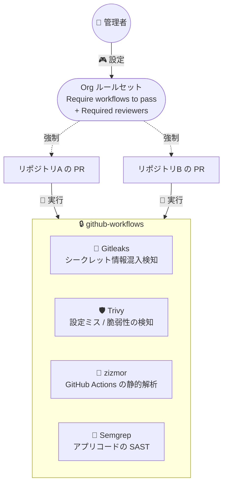
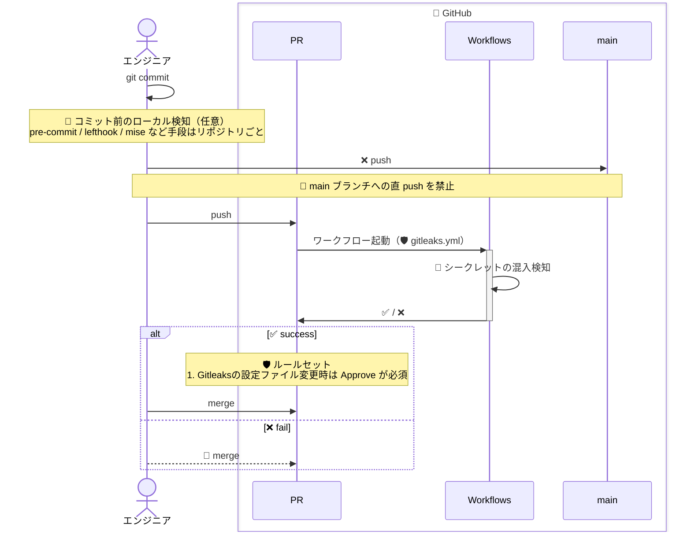

# 🔒 github-workflows
Organization 共通のルールセット/CI/セキュリティワークフローを管理するリポジトリ
> ⚠️ **注意** : GitHub Team プランであることが前提です

## 🚧 防止・検知レイヤー

**開発時**:

## ♻️ 依存関係の自動更新

Renovate によるアップデート PR の起票は `renovate-config` リポジトリのセルフホストランナーが担う(構成・運用はそちらの README を参照)。更新 PR も通常の PR と同じく必須ワークフローを通過しないとマージできない。

## ❓ 使い方
### 🎊 セットアップ

[docs/SETUP.md](./docs/SETUP.md) を参照して、実行してください。