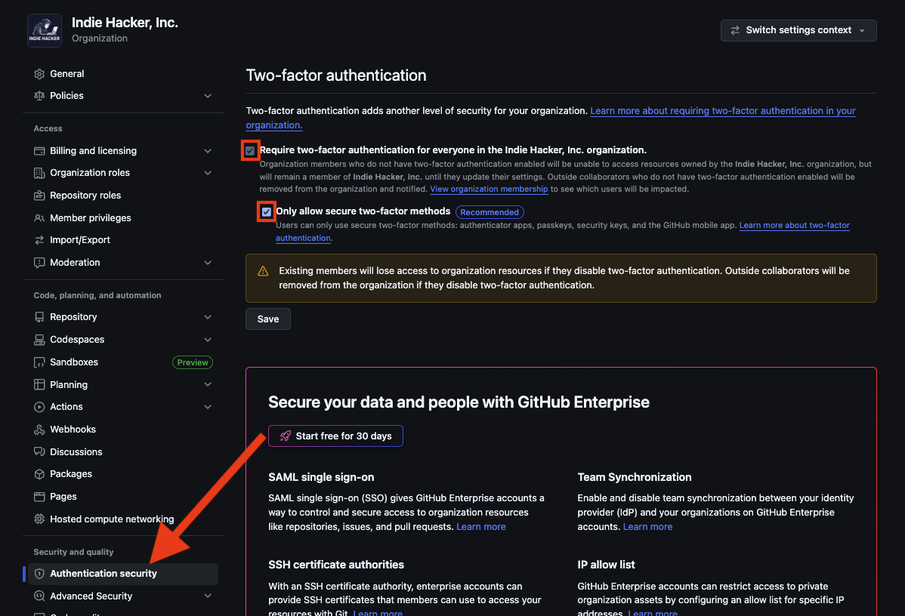

# 🎊 セットアップ

> ⚠️ **前提** : GitHub Team プランを契約していること

## 0. 🏢 Organization の基本設定

<details><summary>🫆 <b>二要素認証を必須にする</b></summary>

🔗 Organization → Settings → Authentication security


*チェックを入れてください*

⚠️ 二要素認証未設定のメンバーは org のリソースへアクセスできなくなり、outside collaborator は org から削除されるため、事前に周知すること
```text
【要対応・期限 ◯月◯日】GitHub の二要素認証(2FA)を設定お願いします。

◯月◯日より、GitHub にて二要素認証を必須化します。
期限までに設定がない場合、Organization のリポジトリなどのリソースにアクセスできなくなります。
(設定すればすぐにアクセスが回復します)

■ 設定手順(5 分程度)
1. https://github.com/settings/security を開く
2. "Two-factor authentication" の [Enable two-factor authentication] をクリック
3. 認証方法として「パスキー / セキュリティキー」「認証アプリ」「GitHub Mobile」のいずれかを選ぶ  ※ SMS は推奨しません

■ 設定済みか確認するには
https://github.com/settings/security を開き、"Two-factor authentication" が
有効(緑のチェック)になっていれば対応済みです。
```

</details>

<details><summary>💪 <b>組織のリポジトリに対するベース権限を設定する</b></summary>

🔗 Organization → Settings → Member privileges

 - 将来メンバーが増える前提で「職務分掌」を意識したい → `No permission`
 - 「組織メンバー＝基本的に全部のコードは見えてよい」という文化 & まだ少人数 → `Read`


</details>

<details><summary>❌ <b>管理者しかリポジトリを作成できないにする</b></summary>

意図しない公開リポジトリの作成を防ぐため、Private, Public 両方のチェックを外し、管理者しかリポジトリを作成できないようにする

🔗 Organization → Settings → Member privileges


*チェックを外してください*

</details>

<details><summary>🚫 <b>組織のリポジトリを fork できないようにする</b></summary>

🔗 Organization → Settings → Member privileges


*チェックを外してください*

</details>

---
## 1. 👥 セキュリティチームを作成
Gitleaks や Trivy などがセキュリティ検知をした時に対応するチームを作成します。<br/>
PR でセキュリティ検知された際はこのチームからの Approve がないとマージできない運用にします。

1. Organization → **Teams** → **New team** でチームを作成
2. 対応者をメンバーに追加
3. Organization → Settings → **Organization roles** → **Role assignments** → **New role assignment** で、作成したチームに以下の 2 ロールをアサイン:

| ロール | 目的 |
|:------|:----|
| `Security manager` | 全リポジトリの Read 権限が自動付与され、2.5・2.6 の Required reviewers が**リポジトリごとのチーム登録(Add teams)なしで自動レビュアー指定**されるようになる(新規リポジトリも自動で対象)。org 全体のセキュリティアラートの閲覧・管理権限も付く |
| `All-repository write` | 承認が Required approvals にカウントされるのは write アクセス保持者のレビューのみのため、Read 相当の Security manager と併用する |

※ 自動レビュアー指定が機能するのは「リポジトリへの直接登録(Add teams)」か「Security manager ロール」の場合のみ。`All-repository write` など一般の org role だけでは、承認は可能になるがレビュアーの自動指定はされない。

> ⚠️ 承認者本人が作成した PR は自己承認できない。チームメンバーが 1 人だけの場合は、
> ルールセットの **Bypass list** に org 管理者を追加してマージする。

---
## 2. 📚 Organization ルールセットを設定
Organization ページ → Settings → Repository → Rulesets を選択し、以下のルールを設定して下さい。

> ⚠️ **前提** : branch ruleset(2.1〜2.7)が保護するのは default branch のみ。リリースも default branch(main)のマージ済みコミットから行う運用を前提とする。
> タグやリリースブランチを起点にデプロイする運用を導入する場合は、レビューを経ないコミットからタグを切れてしまうため、別途 tag ruleset / 対象ブランチの追加が必要。

### `New branch ruleset`

<details><summary><b>「🚫 main への直接 push 禁止」</b></summary>

| 設定項目 | 値                      |
|:-------:|:-----------------------|
| Ruleset Name | `🚫 main への直接 push 禁止` |
| Enforcement status | `Active`               |
| Target repositories | `All repositories` |
| Target branches | `Include default branch` |

Rules セクションで以下にチェック:

- ✅ Restrict deletions (デフォルトブランチの削除を制限する)
- ✅ Require a pull request before merging (マージ前にプルリクエストを必須とする)
- ✅ Block force pushes (リモートブランチへの強制プッシュを禁止)

</details>

<details><summary><b>「✅ PR の承認を必須化」</b></summary>

> 全 PR に人間のレビュー承認(1 名以上)がないとマージできないようにするルール

| 設定項目 | 値                        |
|:-------:|:-------------------------|
| Ruleset Name | `✅ PR の承認を必須化`         |
| Enforcement status | `Active`                 |
| Bypass list | 空のまま<br/>開発者が 1 人だけの場合は「1.」の注意書きを参照 |
| Target repositories | `All repositories`       |
| Target branches | `Include default branch` |

Rules セクションで以下のチェックを外す:

- ⬜︎ **Restrict deletions**
- ⬜︎ **Block force pushes**

以下のチェックを入れる:

- ✅ **Require a pull request before merging**

| 設定項目 | 値 |
|:--------|:--|
| Required approvals | `1` |
| Dismiss stale pull request approvals when new commits are pushed | ✅(承認後に push されたコミットが再レビューなしでマージされるのを防ぐ) |
| Require review from Code Owners | ❌ |
| Require approval of the most recent reviewable push | ❌ |
| Require conversation resolution before merging | ❌ |
| Allowed merge methods | `Merge` / `Squash` / `Rebase`(すべて許可) |

※ 承認が Required approvals にカウントされるのは write アクセス保持者のレビューのみ。PR 作成者本人による自己承認はできない。

</details>

<details><summary><b>「🔑 シークレットの混入検知」</b></summary>

| 設定項目 | 値                        |
|:-------:|:-------------------------|
| Ruleset Name | `🔑 シークレットの混入検知`         |
| Enforcement status | `Active`                 |
| Bypass list | 空のまま                     |
| Target repositories | `All repositories`       |
| Target branches | `Include default branch` |

Rules セクションで以下のチェックを外す:

- ⬜︎ Restrict deletions
- ⬜︎ Block force pushes

以下のチェックを入れる:

 - ✅ **Require workflows to pass before merging** (PRマージ前に指定したワークフローの成功を必須にする) — 「Add workflow」から以下を追加:

| Repository | Branch | Workflow |
|:-----------|:-------|:---------|
| `github-workflows` | `main` | `.github/workflows/gitleaks.yml` |

 - ✅ **Do not require workflows on creation**

※ コミット前のローカル検知(シークレットを履歴に入れる前に止めるレイヤー)はリポジトリごとの任意運用とし、中央からは強制しない。pre-commit / lefthook / mise + gitleaks などツールも書き方もリポジトリによって異なり、設定ファイルの存在を機械的に検査すると正しく運用しているリポジトリまで fail するため。新規リポジトリへの初期設定はテンプレートリポジトリで配布する(本リポジトリ直下の `.pre-commit-config.yaml` が実例)。

※ PR 時のスキャン対象は差分(base..head)のみ。導入前から履歴に混入しているシークレットは検査されないため、既存リポジトリを本ルールセットに乗せる際は全履歴を一度スキャンしておく(検知されたらローテーション+履歴からの除去を行う):

```bash
gitleaks git . --redact --exit-code 1 --ignore-gitleaks-allow
```

</details>

<details><summary><b>「🛡️ 脆弱性・IaC 設定ミス検知」</b></summary>

| 設定項目 | 値 |
|:-------:|:--|
| Ruleset Name | `🛡️ 脆弱性・IaC 設定ミス検知` |
| Enforcement status | `Active` |
| Bypass list | 空のまま |
| Target repositories | `All repositories` |
| Target branches | `Include default branch` |

Rules セクションで以下のチェックを外す:

- ⬜︎ **Restrict deletions**
- ⬜︎ **Block force pushes**

以下のチェックを入れる:

- ✅ **Require workflows to pass before merging** (PRマージ前に指定したワークフローの成功を必須にする) — 「Add workflow」から以下を追加:

| Repository | Branch | Workflow |
|:-----------|:-------|:---------|
| `github-workflows` | `main` | `.github/workflows/trivy.yml` |
| `github-workflows` | `main` | `.github/workflows/zizmor.yml` |
| `github-workflows` | `main` | `.github/workflows/semgrep.yml` |
| `github-workflows` | `main` | `.github/workflows/ghalint.yml` |

- ✅ **Do not require workflows on creation**

※ `ghalint` は必須ワークフローのため全 PR で起動されるが、GitHub Actions 関連ファイル(`.github/workflows/` と ghalint の設定ファイル)に変更がない PR ではワークフロー内の判定で lint を skip し success になる。
※ `trivy` の検知レベルは中央が下限(`HIGH` / `CRITICAL`)を持ち、各リポジトリ直下の `trivy.yaml` の `severity` は**下限に上乗せする方向にのみ**効く(`MEDIUM` を足すことはできるが、`HIGH` を外すことはできない)。`scanners` / `exit-code` / `ignore-unfixed` は下限そのもののためリポジトリ側からは変更できない。

</details>

<details><summary><b>「✔️ セキュリティ設定ファイル変更の承認必須化」</b></summary>

> セキュリティ検知の設定ファイル(`.gitleaksignore` / `.trivyignore` など)を変更する PR にセキュリティチーム(`security`)の承認を必須化するルール

| 設定項目 | 値                        |
|:-------:|:-------------------------|
| Ruleset Name | `✔️ セキュリティ設定変更の承認必須化`    |
| Enforcement status | `Active`                 |
| Bypass list | 空のまま<br/>承認者が 1 人だけの場合は「1.」の注意書きを参照                |
| Target repositories | `All repositories`       |
| Target branches | `Include default branch` |

Rules セクションで以下のチェックを外す:

- ⬜︎ **Restrict deletions**
- ⬜︎ **Block force pushes**

以下のチェックを入れる:

- ✅ **Require a pull request before merging**

| 設定項目 | 値 |
|:--------|:--|
| Required approvals | `0`(承認必須化は下記の Required reviewers で行う) |
| Dismiss stale pull request approvals when new commits are pushed | ✅ |
| Require review from Code Owners | ❌ |
| Require approval of the most recent reviewable push | ❌ |
| Require conversation resolution before merging | ❌ |
| Allowed merge methods | `Merge` / `Squash` / `Rebase`(すべて許可) |

同ルール内の **Require review from specific teams** に以下を追加:

| 設定項目 | 値                                                                                                                                                                                                        |
|:--------|:---------------------------------------------------------------------------------------------------------------------------------------------------------------------------------------------------------|
| Reviewer | `security` チーム(「1.」で作成)                                                                                                                                                                                  |
| Approvals | `1`                                                                                                                                                                                                      |

File patterns:
```
.gitleaksignore
.gitleaks.toml
.trivyignore
.trivyignore.yaml
trivy.yaml
.github/trivy-image.yml
.github/trivy-image.yaml
.github/zizmor.yml
.semgrepignore
**/.semgrepignore
ghalint.yml
ghalint.yaml
.ghalint.yml
.ghalint.yaml
.github/ghalint.yml
.github/ghalint.yaml
```

※ `trivy.yaml`(リポジトリ直下)は Trivy が自動読込する設定ファイルで、`ignorefile` / `ignore-policy` により抑制先を差し替えられるため対象に含める。レビュー時はこの 2 項目が上記対象外のファイルを指していないかを確認する<br/>
※ `**/.semgrepignore` は Semgrepignore v2(Semgrep 1.117 以降のデフォルト)でサブディレクトリの `.semgrepignore` も有効になるため対象に含める<br/>
※ zizmor の設定はワークフロー側(`.github/workflows/zizmor.yml` の `--config` / `--no-config`)で `.github/zizmor.yml` に固定しているため、自動探索され得る他パス(リポジトリ直下の `zizmor.yml` 等)の列挙は不要

</details>

<details><summary><b>「🛠️ 検知ワークフロー変更の承認必須化」</b></summary>

> 必須ワークフローの実体(本リポジトリの `.github/workflows/`)を変更する PR にセキュリティチーム(`security`)の承認を必須化するルール。
> 必須ワークフロー(2.3〜2.4・2.7)は本リポジトリの `main` 上の定義を参照しているため、検知を弱める変更(severity の引き下げ・`exit-code: 0` 化など)が通常の承認(2.2)だけで通ると org 全体の検知が無効化されてしまう

| 設定項目 | 値                        |
|:-------:|:-------------------------|
| Ruleset Name | `🛠️ 検知ワークフロー変更の承認必須化`    |
| Enforcement status | `Active`                 |
| Bypass list | 空のまま<br/>承認者が 1 人だけの場合は「1.」の注意書きを参照 |
| Target repositories | `Select repositories` → `github-workflows` のみ |
| Target branches | `Include default branch` |

Rules セクションで以下のチェックを外す:

- ⬜︎ **Restrict deletions**
- ⬜︎ **Block force pushes**

以下のチェックを入れる:

- ✅ **Require a pull request before merging**

| 設定項目 | 値 |
|:--------|:--|
| Required approvals | `0`(承認必須化は下記の Required reviewers で行う) |
| Dismiss stale pull request approvals when new commits are pushed | ✅ |
| Require review from Code Owners | ❌ |
| Require approval of the most recent reviewable push | ❌ |
| Require conversation resolution before merging | ❌ |
| Allowed merge methods | `Merge` / `Squash` / `Rebase`(すべて許可) |

同ルール内の **Require review from specific teams** に以下を追加:

| 設定項目 | 値 |
|:--------|:--|
| Reviewer | `security` チーム(「1.」で作成) |
| Approvals | `1` |

File patterns:
```
.github/workflows/**
```

</details>

<details><summary><b>「✏️ スタイルチェック」</b></summary>

> ワークフロー定義の構文チェック(actionlint)、Terraform の lint(tflint)と書式(terraform fmt)、シェルスクリプトの lint(shellcheck)を必須化するルール。セキュリティ検知(2.3〜2.6)とは性質が異なるため別ルールセットで管理する

| 設定項目 | 値                        |
|:-------:|:-------------------------|
| Ruleset Name | `✏️ スタイルチェック`            |
| Enforcement status | `Active`                 |
| Bypass list | 空のまま                     |
| Target repositories | `All repositories`       |
| Target branches | `Include default branch` |

Rules セクションで以下のチェックを外す:

- ⬜︎ **Restrict deletions**
- ⬜︎ **Block force pushes**

以下のチェックを入れる:

- ✅ **Require workflows to pass before merging** (PRマージ前に指定したワークフローの成功を必須にする) — 「Add workflow」から以下を追加:

| Repository | Branch | Workflow |
|:-----------|:-------|:---------|
| `github-workflows` | `main` | `.github/workflows/actionlint.yml` |
| `github-workflows` | `main` | `.github/workflows/tflint.yml` |
| `github-workflows` | `main` | `.github/workflows/terraform-fmt.yml` |
| `github-workflows` | `main` | `.github/workflows/shellcheck.yml` |

- ✅ **Do not require workflows on creation**

※ `actionlint` は必須ワークフローのため全 PR で起動されるが、ワークフロー関連ファイル(`.github/workflows/` と `.github/actionlint.yml`)に変更がない PR ではワークフロー内の判定で lint を skip し success になる。<br/>
※ `tflint` も同様に全 PR で起動されるが、Terraform 関連ファイル(`*.tf` / `*.tfvars` / `.tflint.hcl` 等)に変更がない PR では lint を skip し success になる(Terraform 未使用のリポジトリでも合格する)。設定は lint 対象ディレクトリからリポジトリルートへ遡って最初に見つかった `.tflint.hcl` が適用され(`terraform/.tflint.hcl` のような中間ディレクトリ配置でも効く)、1 つも無ければ組み込み terraform ruleset の recommended プリセットで lint される。<br/>
※ `terraform fmt` も同様に全 PR で起動されるが、HCL(`*.tf` / `*.tfvars` / `*.tftest.hcl`)に変更がない PR では検査を skip し success になる。検査対象は変更されたファイルのあるディレクトリのみ(リポジトリ全体を `-recursive` で見ると、その PR が触っていない箇所の既存の崩れでも fail するため)。terraform の版は中央で固定しており、リポジトリ側の宣言(`.terraform-version` / `mise.toml` 等)は参照しない。<br/>
※ `terraform validate` / `terraform test` は必須ワークフローに含めない。どちらも `terraform init` を必要とし、init はリポジトリの `.tf` が宣言した任意の module source を取得し、validate は provider のバイナリを起動する。必須ワークフローは全リポジトリの全 PR で走るため、対象リポジトリのコードを実行しない解析のみに揃えている(必要なリポジトリは自前のワークフローで実行する)。<br/>
※ `shellcheck` も同様に全 PR で起動されるが、シェルスクリプト(`*.sh` / `*.bash` / `*.ksh`)に変更がない PR では lint を skip し success になる。lint 対象は変更されたスクリプトのみで、検出は severity `warning` 以上(error / warning)に限定される。拡張子で判定するため、拡張子のないスクリプトは対象外。抑制設定はリポジトリ直下の `.shellcheckrc` で行う。

</details>


### `New push ruleset`

<details><summary><b>「🚫 機密ファイルの push 禁止」</b></summary>

秘密鍵や `.env` などの機密ファイルを、履歴に入る前にサーバー側で拒否する push ルールセット
(Gitleaks は PR 時の検知のため、検知された時点で秘密情報はリモートの履歴に残っている)。
ファイル内容に対するコミット前のローカル検知は各リポジトリの git hook(任意運用)が担う。
2.1〜2.7 とは種類が異なり「**New push ruleset**」から作成する。

| 設定項目 | 値 |
|:-------:|:--|
| Ruleset Name | `🚫 機密ファイルの push 禁止` |
| Enforcement status | `Active` |
| Bypass list | 空のまま |
| Target repositories | `All repositories` |

Rules セクションで以下を設定:

✅ **Restrict file paths**

| File path |
|:----------|
| `.env` |
| `**/.env` |
| `id_rsa` |
| `**/id_rsa` |
| `id_ed25519` |
| `**/id_ed25519` |

※ `.env.example` 等のテンプレートを誤ブロックしないよう `.env.*` は対象にしない(実値が入った `.env.*` は Gitleaks が検知する)。

✅ **Restrict file extensions**

| Extension |
|:----------|
| `pem` / `key` / `p12` / `pfx` / `jks` / `keystore` / `tfstate` |

✅ **Restrict file size** — `5MB`

</details>

---
## 3. ⚙️ GitHub Actions のセキュリティ設定

Organization → Settings → **Actions** → **General** で以下を設定する。

<details><summary><b>Actions permissions(実行できる action の制限)</b></summary>

| 設定項目 | 値 |
|:--------|:--|
| Policies | `Allow <org>, and select non-<org> actions and reusable workflows` |
| Allow actions created by GitHub | ✅ |
| Allow specified actions and reusable workflows | 下記のパターンを登録 |

```
aquasecurity/trivy-action@*,
docker/setup-buildx-action@*,
docker/build-push-action@*,
dorny/paths-filter@*,
renovatebot/github-action@*
```

※ 各リポジトリが新しい外部 action を使う場合はこのリストへの追加が必要(SHA ピン留めは各ワークフロー側で行う)。<br/>
※ `actions/create-github-app-token` は「Allow actions created by GitHub」で許可済みのため個別登録は不要。

</details>

<details><summary><b>Workflow permissions(<code>GITHUB_TOKEN</code> のデフォルト権限)</b></summary>

| 設定項目 | 値 |
|:--------|:--|
| Workflow permissions | `Read repository contents and packages permissions` |
| Allow GitHub Actions to create and approve pull requests | ❌(チェックを外す) |

- `permissions:` を明示しているワークフロー(本リポジトリのものを含む)には影響しない
- 「create and approve pull requests」を無効化することで、`GITHUB_TOKEN` による自己承認で 2.2 / 2.5 / 2.6 の承認必須化が迂回されるのを防ぐ
- この設定は `GITHUB_TOKEN` のみが対象。Renovate(5章)は GitHub App トークンで PR を作るため影響を受けない

</details>

---
## 4. 🚨 Dependabot alerts を有効化

> Trivy は PR 時にしか実行されないため、マージ後に新規公開された CVE は Dependabot alerts で検知する。<br/>
> 依存関係の更新は Renovate が担うため、alerts のみ有効化する。

1. Organization → Settings → **Advanced Security** → **Configurations** を選択
2. 「**Custom configuration**」を選択する
   - 初回は「**Set up Advanced Security**」画面が表示されるが、**Review は押さない**(既定値は有料の Secret Protection / Code Security まで `Enabled` になっており、Dependabot も更新 PR 込みで有効化され Renovate と競合する)
3. 以下の設定で configuration を作成し「**Save configuration**」:

| 設定項目 | 値 |
|:--------|:--|
| Configuration name | `dependabot-alerts` |
| Secret Protection | `Not set`(有料。$19/committer/月) |
| Code Security | `Not set`(有料。$30/committer/月) |
| Dependency graph | `Enabled` |
| Dependabot alerts | `Enabled` |
| Security updates | `Disabled`(更新 PR は Renovate に集約) |
| Malware alerts | `Enabled`(無料。依存関係へのマルウェア混入を通知) |
| Private vulnerability reporting | `Enabled`(初期値のまま。無料・public リポジトリのみ対象) |
| 上記以外の項目 | 初期値のまま変更不要(`Not set` / `Disabled`) |
| Policy: Use as default for newly created repositories | `All repositories`(新規リポジトリに自動適用) |
| Policy: Enforce configuration | `Enforce`(リポジトリ側での設定変更を禁止) |

4. Configurations 一覧で作成した configuration を選択し、**Apply to** → `All repositories` で全リポジトリに適用

---
## 5. ♻️ Renovate を導入

> 依存関係のアップデート PR は、`renovate-config` リポジトリのセルフホスト型 Renovate ランナーが毎日起票する

セットアップ手順(GitHub App の作成・シークレットの登録)と運用方法は `renovate-config` リポジトリの `SETUP.md` / `README.md` を参照。

※ ランナーの実行ログには autodiscover した Org 全リポジトリ名(private 含む)が出力されるため、ランナーは本リポジトリではなく private の `renovate-config` に置いて運用する。
